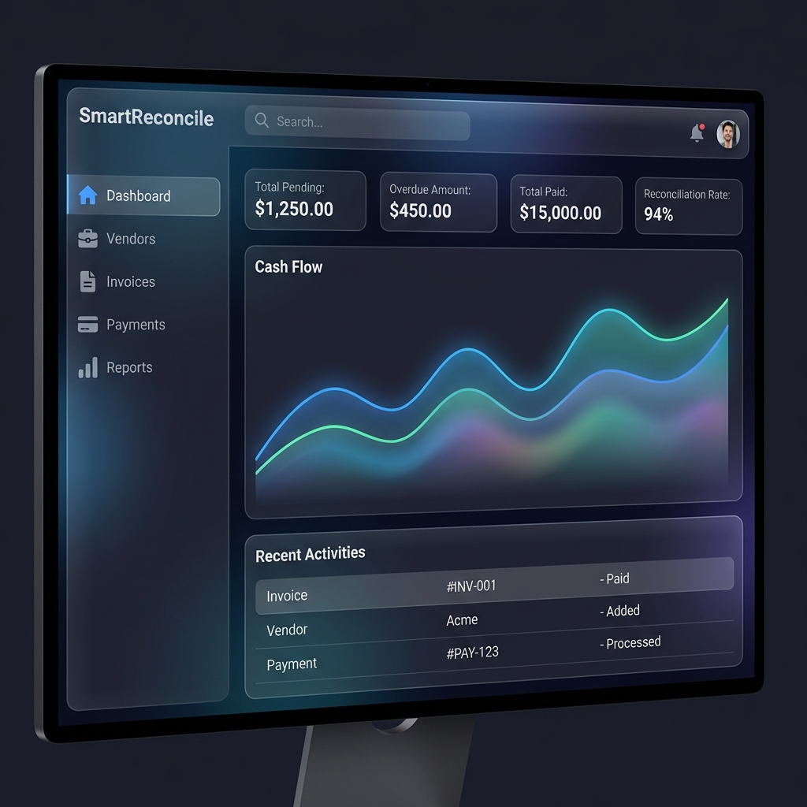
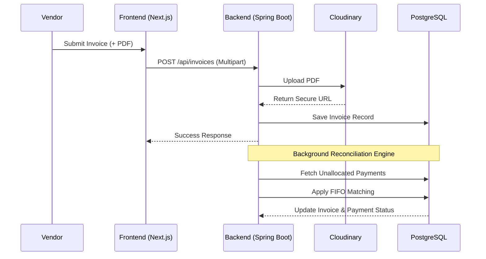

# 🚀 SmartReconcile: Intelligent Vendor Billing & Reconciliation


> **Transforming B2B Financial Operations with Automated Precision.**

SmartReconcile is a state-of-the-art **Vendor Billing and Payment Reconciliation** platform designed to eliminate manual data entry, reduce financial discrepancies, and streamline the accounts payable process. Built with a robust **Spring Boot** backend and a premium **Next.js** frontend, it provides an end-to-end solution for modern enterprises.

---

## 📱 Live Dashboard Preview

Efficiently manage your finances with our intuitive, data-driven interface.



---

## 🌟 Key Features

### 🔐 Multi-Tier Security & Isolation
- **Granular RBAC**: Four distinct roles (Admin, Finance Manager, Accounts Executive, Vendor User) with strictly enforced boundaries.
- **Vendor Isolation**: Proprietary data isolation logic ensures vendors can only access their own history, preventing cross-tenant data leaks.
- **JWT Authentication**: Secure, stateless session management with encrypted token handling.

### 📄 Intelligent Invoice Management
- **Cloud-Native Storage**: Integrated with **Cloudinary** for secure, high-availability storage of invoice PDFs and receipts.
- **Dynamic Workflows**: Modern, drag-and-drop interfaces for effortless billing submission.
- **Audit Trails**: Complete history of every invoice from submission to final reconciliation.

### 🤖 Automated Reconciliation Engine
- **FIFO Logic**: Advanced First-In-First-Out matching algorithm that automatically links payments to outstanding invoices.
- **Discrepancy Handling**: Real-time identification of partial payments, overpayments, and unallocated funds.
- **Manual Override**: Precision tools for accounts executives to handle complex edge cases manually.

### 📊 Financial Analytics
- **Interactive Visualizations**: High-performance charts powered by `Recharts` for cash flow trends and vendor aging.
- **KPI Dashboards**: Instant visibility into key metrics like **Reconciliation Rate**, **Overdue Liability**, and **Total Disbursement**.

---

## 🛠️ Technology Stack

| Layer | Technologies |
| :--- | :--- |
| **Frontend** |     |
| **Backend** |    |
| **Storage** |   |
| **Integrations**|   |

---

## 🏗️ System Architecture & Workflow




---

## 💼 Business Value

- **Efficiency**: Reduces manual reconciliation time by up to **85%**.
- **Accuracy**: Eliminates human error in double-entry and payment allocation.
- **Compliance**: Maintains a rigorous audit trail for financial audits and tax compliance.
- **Vendor Trust**: Provides vendors with self-service transparency into their payment status.

---

## 🧑‍💻 Developer Guide

### Prerequisites
- **Java 17+** | **Node.js 18+** | **PostgreSQL** | **Cloudinary Account**

### Setup & Installation

1. **Clone & Explore**
   ```bash
   git clone https://github.com/omkarrathod23/smartreconcile.git
   cd smartreconcile
   ```

2. **Backend Configuration**
   Edit `backend/src/main/resources/application.properties`:
   ```properties
   spring.datasource.url=jdbc:postgresql://localhost:5432/smartreconcile
   spring.datasource.username=postgres
   spring.datasource.password=yourpassword
   
   # Cloudinary Setup
   cloudinary.cloud-name=your_name
   cloudinary.api-key=your_key
   cloudinary.api-secret=your_secret
   ```
   🚀 Launch: `cd backend && ./mvnw spring-boot:run`

3. **Frontend Configuration**
   🚀 Launch: `cd frontend && npm install && npm run dev`

---

## 📝 API Overview (Highlights)

| Method | Endpoint | Description | Roles |
| :--- | :--- | :--- | :--- |
| `POST` | `/api/auth/signin` | Authenticate and get JWT | Public |
| `POST` | `/api/vendors/onboard` | Register new supplier and portal user | Admin |
| `GET` | `/api/invoices` | List invoices (with filters) | Internal Staff |
| `POST` | `/api/reconciliation/run` | Trigger FIFO matching sequence | Finance Mgr |

---

## 📈 Roadmap
- [x] Cloudinary File Upload Integration
- [x] Role-Based Data Isolation
- [x] Intelligent FIFO Reconciliation
- [ ] **AI-Powered OCR**: Automatic data extraction from invoice images.
- [ ] **Multi-Currency**: Automatic exchange rate handling for global vendors.
- [ ] **Mobile App**: PWA for vendors to snap and upload receipts on the go.

---

## 🤝 Contributing
Contributions are welcome! Please fork the repository and submit a pull request for any enhancements.

## 📄 License
This project is licensed under the **MIT License**.

---

<p align="center">
  <b>SmartReconcile</b> - The Future of Automated Accounts Payable.
  <br>
  Developed by <a href="https://github.com/omkarrathod23">Omkar Rathod</a>
</p>
