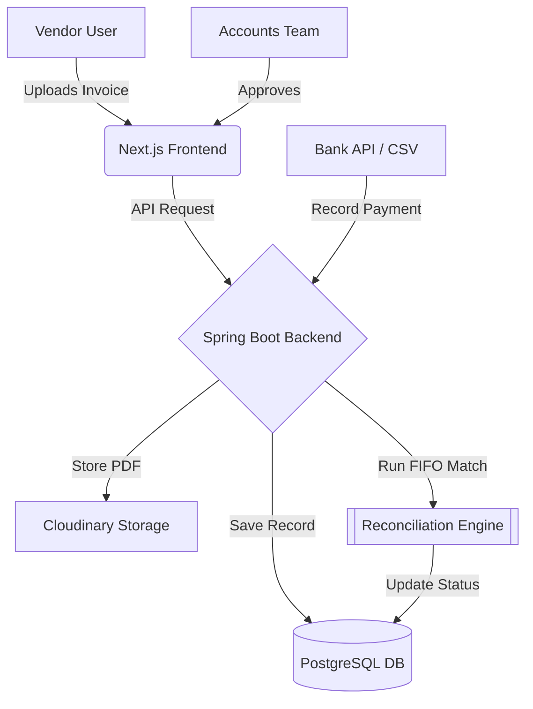

# 🚀 SmartReconcile: Intelligent Vendor Billing & Reconciliation


> **Transforming B2B Financial Operations with Automated Precision.**

SmartReconcile is a state-of-the-art **Vendor Billing and Payment Reconciliation** platform designed to eliminate manual data entry, reduce financial discrepancies, and streamline the accounts payable process. Built with a robust **Spring Boot** backend and a premium **Next.js** frontend, it provides an end-to-end solution for modern enterprises.

---

## 🌟 Key Features

### 🔐 Multi-Tier Security & Isolation
- **Granular RBAC**: Four distinct roles (Admin, Finance Manager, Accounts Executive, Vendor User) with strictly enforced boundaries.
- **Vendor Isolation**: Proprietary data isolation logic ensures vendors can only access their own history, preventing cross-tenant data leaks.

### 📄 Intelligent Invoice Management
- **Cloudinary Integration**: Secure, cloud-native storage for invoice PDFs and receipts.
- **Dynamic Forms**: Modern, drag-and-drop interfaces for effortless billing submission.
- **Real-time Status Tracking**: Instant visibility into "Pending", "Approved", and "Paid" statuses.

### 🤖 Automated Reconciliation
- **FIFO Strategy**: Advanced First-In-First-Out matching algorithm that automatically links payments to outstanding invoices.
- **Discrepancy Detection**: Real-time identification of partial payments and unallocated funds.

### 📊 Financial Insights
- **Dynamic Analytics**: Interactive charts powered by `Recharts` visualizing cash flow trends and vendor aging.
- **Professional Reports**: Comprehensive breakdowns of expense distribution and liability.

---

## 🛠️ Technology Stack

| Layer | Technologies |
| :--- | :--- |
| **Frontend** |     |
| **Backend** |    |
| **Storage** |   |
| **DevOps** |   |

---

## 🏗️ System Architecture




---

## 🧑‍💻 Getting Started

### Prerequisites
- **Java 17+**
- **Node.js 18+**
- **PostgreSQL** instance
- **Cloudinary** account (for file uploads)

### Installation

1. **Clone the Repository**
   ```bash
   git clone https://github.com/omkarrathod23/smartreconcile.git
   cd smartreconcile
   ```

2. **Backend Setup**
   Configure `backend/src/main/resources/application.properties`:
   ```properties
   spring.datasource.url=jdbc:postgresql://localhost:5432/smartreconcile
   cloudinary.cloud-name=your_name
   cloudinary.api-key=your_key
   cloudinary.api-secret=your_secret
   ```
   Run the backend:
   ```bash
   cd backend
   mvn spring-boot:run
   ```

3. **Frontend Setup**
   ```bash
   cd frontend
   npm install
   npm run dev
   ```

---

## 👥 Role Definitions

| Role | Access Level | Responsibilities |
| :--- | :--- | :--- |
| **Admin** | Superuser | System configuration, User management, Auditing. |
| **Finance Manager** | Management | Approval flows, Reconciliation trigger, High-level reports. |
| **Accounts Executive** | Operations | Daily transaction entry, Vendor communications, Payment tracking. |
| **Vendor User** | Self-Service | Invoice submission, Payment tracking, Profile management. |

---

## 📈 Roadmap
- [x] Cloudinary File Upload Integration
- [x] Role-Based Data Isolation
- [x] Intelligent FIFO Reconciliation
- [ ] Multi-Currency Support
- [ ] AI-Powered Document OCR
- [ ] Slack/Email Notification Engine

---

## 📄 License
Distributed under the MIT License. See `LICENSE` for more information.

---

<p align="center">
  Developed with ❤️ by the SmartReconcile Team
</p>
